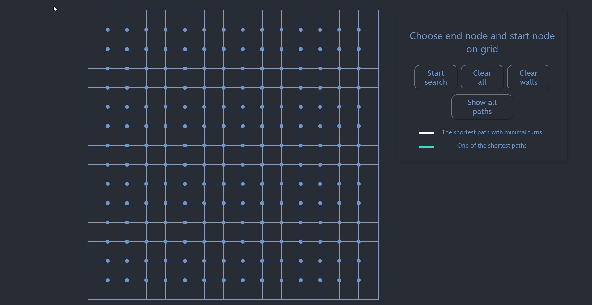

## Demo: 


## Overview
The aim of this web application is to:
- Find the shortest path between two squares/points in a grid.
- Find the least number of turns on a path.
- Avoid walls(Non walkable squares/points) on a path.
- Visualize all paths.

## Quick start

In the project directory, you can run:

```bash
npm install 
```
Then: 
```bash
npm start
```
## How it works


The application is:

* boostraped with [Create React App](https://github.com/facebook/create-react-app).

* automately deployed and hosted to Firebase hosting: CI/CD (Continuous Integration/ Continuous Deployment) pipeline using GitHub actions.

* calling the path finder algorithm through firebase cloud functions.

The path finder algorithm is composed of:  

***Step1: Find at least 4 of the shortest paths:*** 

        Use different famous algorithms:
        *  `AStarFinder` *
        *  `DijkstraFinder` *
        *  `BreadthFirstFinder` *
        *  `BiBreadthFirstFinder` *
        *  `BiDijkstraFinder` *
        *  `IDAStarFinder.js` *
        *  `JumpPointFinder` *
        *  `OrthogonalJumpPointFinder` *
        
Note: These algorithms were implemented using the path finding library for js. [Library](https://github.com/qiao/PathFinding.js) 

***Step 2: Smoothening process( Find the shortest path with minimal turns)***

        1.  The algorithm takes the array of paths returned by the first step.

        2.  Find the path with minimal turns. 

The path finder algorithm: [the algorithm's gist](https://gist.github.com/ouiam-dot/b93a2fac701dfe70bb9cbc821ae2c72f) 

License
-------

[MIT License](http://www.opensource.org/licenses/mit-license.php)


